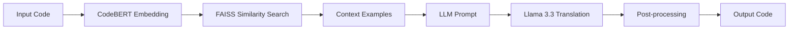

# 🔄 Code Translator: Java ↔ C#

A powerful AI-driven code translation tool that converts code between Java and C# using semantic search and large language models. Built with Streamlit for an intuitive web interface.


## ✨ Features

- **🎯 Bidirectional Translation**: Convert Java to C# and vice versa
- **🧠 AI-Powered**: Uses CodeBERT for semantic understanding and Llama 3.3 for generation
- **🔍 Semantic Search**: FAISS-based similarity search for contextual examples
- **🎨 Modern UI**: Clean, responsive interface with real-time translation
- **📊 Advanced Settings**: Configurable temperature, token limits, and example count
- **📝 Translation History**: Track and revisit recent translations
- **⚡ Fast Performance**: Optimized vector operations and caching
- **🛡️ Error Handling**: Comprehensive error management and user feedback

## 🏗️ Architecture



### Core Components

1. **Embedding Model**: Microsoft CodeBERT for code understanding
2. **Vector Search**: FAISS for efficient similarity matching
3. **Translation Model**: Llama 3.3 70B via Groq API
4. **Frontend**: Streamlit web application
5. **Dataset**: Pre-computed embeddings for 10,295+ code pairs

## 🚀 Quick Start

### Prerequisites

- Python 3.8+
- Internet connection (for model downloads)
- Groq API access (free tier available)

### Installation

1. **Clone the repository**:
   ```bash
   git clone <repository-url>
   cd code-translator
   ```

2. **Install dependencies**:
   ```bash
   pip install -r requirements.txt
   ```

3. **Set up your dataset structure**:
   ```
   project/
   ├── app.py
   ├── model.py
   ├── requirements.txt
   └── dataset/
       ├── retrieval_mapping.pkl
       ├── cs_vectors.npy
       └── java_vectors.npy
   ```

4. **Configure API key** (optional):
   ```bash
   # Windows Command Prompt
   set GROQ_API_KEY=your_api_key_here
   
   # Windows PowerShell
   $env:GROQ_API_KEY="your_api_key_here"
   
   # Linux/Mac
   export GROQ_API_KEY="your_api_key_here"
   ```

5. **Run the application**:
   ```bash
   streamlit run app.py
   ```

6. **Open your browser** and navigate to `http://localhost:8501`

## 💻 Usage

### Basic Translation

1. **Select Translation Direction**: Choose Java→C# or C#→Java
2. **Enter Your Code**: Paste or type code in the input area
3. **Click Translate**: Hit the "🚀 Translate Code" button
4. **Copy Result**: Use the output for your project

### Advanced Features

#### Settings Panel
- **Max Tokens**: Control output length (100-1000)
- **Temperature**: Adjust creativity (0.0-1.0)
- **Similar Examples**: Number of context examples (1-5)

#### Quick Examples
- Use built-in examples to test functionality
- Clear button to reset input area
- Translation history for reference

### Example Translations

**Java Input**:
```java
public class HelloWorld {
    public void sayHello() {
        System.out.println("Hello, World!");
    }
    
    public int add(int a, int b) {
        return a + b;
    }
}
```

**C# Output**:
```csharp
public class HelloWorld 
{
    public void SayHello() 
    {
        Console.WriteLine("Hello, World!");
    }
    
    public int Add(int a, int b) 
    {
        return a + b;
    }
}
```

## 🛠️ Configuration

### Environment Variables

| Variable | Description | Default |
|----------|-------------|---------|
| `GROQ_API_KEY` | Groq API key for LLM access | Built-in key (limited) |
| `KMP_DUPLICATE_LIB_OK` | Fix OpenMP conflicts | `TRUE` |
| `OMP_NUM_THREADS` | CPU thread limit | Auto |

### Model Configuration

Edit `model.py` to customize:

```python
# API Configuration
api_key = "your-groq-api-key"
model_name = "llama-3.3-70b-versatile"

# Search Configuration
dimension = 768  # CodeBERT embedding size
top_k = 3       # Number of similar examples

# Generation Configuration
max_tokens = 300
temperature = 0.5
```

## 📁 File Structure

```
code-translator/
├── app.py                 # Streamlit frontend
├── model.py              # Core translation logic
├── requirements.txt      # Python dependencies
├── README.md            # This file
└── dataset/
    ├── retrieval_mapping.pkl  # Code snippet mappings
    ├── cs_vectors.npy        # C# embeddings
    └── java_vectors.npy      # Java embeddings
```

## 🔧 Troubleshooting

### Common Issues

**1. OpenMP Error**
```
OMP: Error #15: Initializing libomp140.x86_64.dll
```
**Solution**: Set `KMP_DUPLICATE_LIB_OK=TRUE` environment variable

**2. Model Loading Failed**
```
Failed to initialize translator
```
**Solutions**:
- Check internet connection
- Verify dataset files exist
- Ensure sufficient disk space
- Try restarting the application

**3. API Rate Limits**
```
Translation Error: Rate limit exceeded
```
**Solutions**:
- Wait a few minutes before retrying
- Use your own Groq API key
- Reduce translation frequency

**4. Memory Issues**
```
CUDA out of memory / RAM insufficient
```
**Solutions**:
- Close other applications
- Reduce max_tokens setting
- Use CPU instead of GPU

### Performance Optimization

**For CPU Usage**:
```bash
set OMP_NUM_THREADS=4
set MKL_NUM_THREADS=4
streamlit run app.py
```

**For GPU Usage**:
- Ensure CUDA is installed
- Model automatically detects and uses GPU
- Monitor GPU memory usage

## 🧪 Testing

### Unit Tests
```bash
python model.py  # Run built-in examples
```

### Manual Testing
1. Test both translation directions
2. Try various code complexities
3. Test error handling with invalid input
4. Verify UI responsiveness

## 🤝 Contributing

We welcome contributions! Here's how to help:

1. **Fork** the repository
2. **Create** a feature branch: `git checkout -b feature/amazing-feature`
3. **Commit** your changes: `git commit -m 'Add amazing feature'`
4. **Push** to the branch: `git push origin feature/amazing-feature`
5. **Open** a Pull Request

### Development Setup

```bash
# Install development dependencies
pip install -r requirements.txt
pip install black flake8 pytest

# Run linting
black . && flake8 .

# Run tests
pytest tests/
```

## 📊 Technical Details

### Models Used

| Component | Model | Purpose |
|-----------|-------|---------|
| Embeddings | microsoft/codebert-base | Code understanding |
| Translation | llama-3.3-70b-versatile | Code generation |
| Search | FAISS IndexFlatL2 | Similarity matching |

### Performance Metrics

- **Translation Speed**: ~2-5 seconds per request
- **Accuracy**: High semantic preservation
- **Dataset Size**: 10,295+ validated code pairs
- **Memory Usage**: ~2GB RAM (CPU mode)

### API Limits

- **Groq Free Tier**: 14,400 requests/day
- **Rate Limit**: 30 requests/minute
- **Token Limit**: 8,192 per request

## 🙏 Acknowledgments

- **Microsoft** for CodeBERT model
- **Meta** for Llama architecture
- **Groq** for fast inference API
- **Streamlit** for the web framework
- **FAISS** for efficient similarity search
